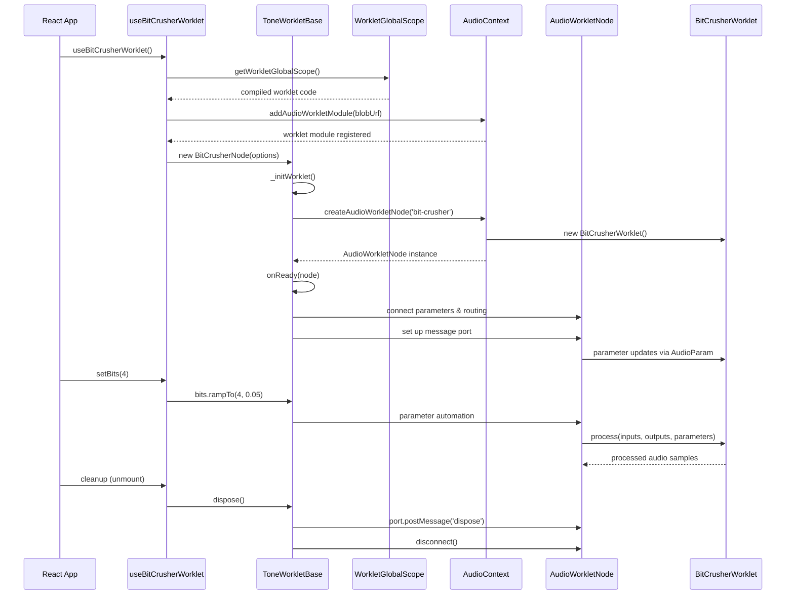
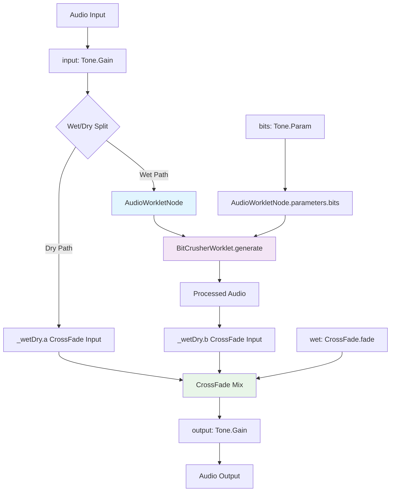
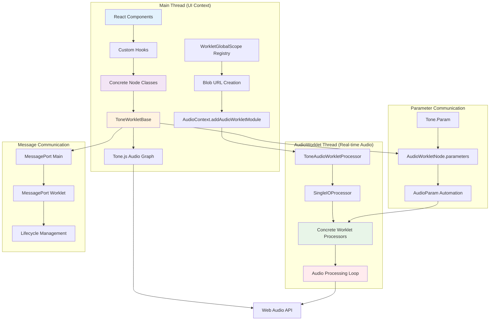
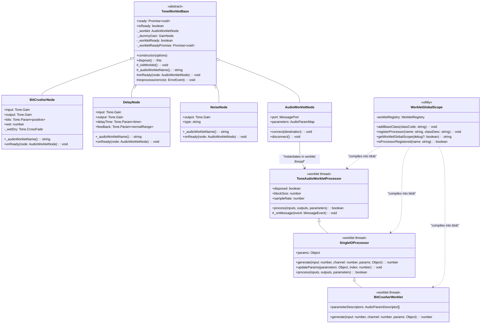

# Tone AudioWorklet Demo Architecture Review

This document provides an extensive analysis of how the **tone-audioworklet-demo** project builds and manages an audio worklet class by extending the `tone` library's `ToneAudioNode`. It covers core components, class structure, initialization flow, and data flow, accompanied by architecture diagrams.

---

## 📦 Core Components

### Main Architecture Components

- **`ToneWorkletBase`** (`src/lib/ToneWorkletBase.ts`): Abstract base class extending `Tone.ToneAudioNode` that handles loading and instantiating an `AudioWorkletNode`.
- **`WorkletGlobalScope`** (`src/lib/WorkletGlobalScope.ts`): Registry system that manages and compiles worklet code into a single JavaScript blob for injection into the AudioWorklet context.
- **Concrete Node Classes**:
  - **`BitCrusherNode`** (`src/lib/BitCrusherNode.ts`)
  - **`DelayNode`** (`src/lib/DelayNode.ts`)
  - **`NoiseNode`** (`src/lib/NoiseNode.ts`)

### Worklet Processor Hierarchy

- **`ToneAudioWorkletProcessor`** (`src/worklets/ToneAudioWorkletProcessor.worklet.ts`): Base class providing lifecycle management and message handling within the worklet thread.
- **`SingleIOProcessor`** (`src/worklets/SingleIOProcessor.worklet.ts`): Abstract class extending `ToneAudioWorkletProcessor` for single-input/single-output processing with sample-by-sample processing interface.
- **Concrete Processors**: Individual worklet implementations (e.g., `BitCrusherWorklet`) extending `SingleIOProcessor`.

### React Integration Layer

- **Custom Hooks** (`src/hooks/`): React hooks like `useBitCrusherWorklet` that manage worklet lifecycle and provide React-friendly interfaces.
- **UI Components** (`src/components/`): React components that use the hooks to provide user controls for audio parameters.

Each concrete node class extends `ToneWorkletBase`, implements `_audioWorkletName()`, and defines its own `onReady()` to wire parameters and routing.

---

## 🏗️ Class Structure & Worklet Registry System

### ToneWorkletBase Structure

```typescript
// ToneWorkletBase outline
abstract class ToneWorkletBase<
	Options extends ToneWorkletBaseOptions,
> extends ToneAudioNode<Options> {
	protected abstract _audioWorkletName(): string;
	protected abstract onReady(node: AudioWorkletNode): void;

	constructor(options: Options) {
		/* Creates dummy gain for parameter swapping */
		/* Sets up worklet ready promise */
		/* Initiates worklet loading */
	}

	private _initWorklet(): void {
		/* Creates blob from WorkletGlobalScope registry */
		/* Registers worklet module with AudioContext */
		/* Creates AudioWorkletNode instance */
		/* Calls onReady() hook */
	}

	get ready(): Promise<void> {
		/* resolved when worklet is ready */
	}
	get isReady(): boolean {
		/* true after instantiation */
	}
	dispose(): this {
		/* cleanup AudioWorkletNode & message ports */
	}
}
```

### WorkletGlobalScope Registry System

The `WorkletGlobalScope` module provides a sophisticated registry system that manages different types of worklet code:

```typescript
interface WorkletRegistry {
	baseClasses: Set<string>; // Base class definitions (ToneAudioWorkletProcessor)
	processors: Set<string>; // Processor implementations (BitCrusherWorklet)
	utilities: Set<string>; // Utility functions and constants
	registrations: Map<string, string>; // registerProcessor() calls
}
```

**Key Functions:**

- **`addBaseClass(classCode)`**: Adds base class definitions to the registry
- **`registerProcessor(name, classDesc)`**: Creates `registerProcessor()` calls for worklet registration
- **`getWorkletGlobalScope(debug?)`**: Compiles all registered code into a single JavaScript string in the correct load order

### Concrete Node Implementation Pattern

```typescript
// Example: BitCrusherNode
export class BitCrusherNode extends ToneWorkletBase<BitCrusherNodeOptions> {
	readonly input: Tone.Gain;
	readonly output: Tone.Gain;
	readonly bits: Tone.Param<'positive'>;
	private _wetDry: Tone.CrossFade;

	constructor(options: Partial<BitCrusherNodeOptions> = {}) {
		super(options);
		// Create I/O nodes and parameters
		// Set up wet/dry mixing
	}

	protected _audioWorkletName(): string {
		return 'bit-crusher'; // Must match registered processor name
	}

	onReady(node: AudioWorkletNode): void {
		// Connect audio routing: input -> worklet -> wet side of crossfade
		// Connect dry path: input -> dry side of crossfade
		// Map Tone.js parameters to AudioWorklet parameters
		// Set up message port communication if needed
	}
}
```

### Worklet Processor Hierarchy

```typescript
// Base processor with lifecycle management
class ToneAudioWorkletProcessor extends AudioWorkletProcessor {
	constructor(options) {
		this.disposed = false;
		this.blockSize = 128;
		this.sampleRate = sampleRate;
		// Set up message port handling
	}
}

// Single I/O processing abstraction
class SingleIOProcessor extends ToneAudioWorkletProcessor {
	generate(input, channel, params) {
		/* Override in subclass */
	}
	process(inputs, outputs, parameters) {
		// Handles parameter updates per sample
		// Calls generate() for each sample/channel
	}
}

// Concrete processor implementation
class BitCrusherWorklet extends SingleIOProcessor {
	static get parameterDescriptors() {
		return [{ name: 'bits', defaultValue: 8, minValue: 1, maxValue: 16 }];
	}

	generate(input, _channel, parameters) {
		// Bit reduction algorithm
		const step = Math.pow(0.5, parameters.bits - 1);
		return step * Math.floor(input / step + 0.5);
	}
}
```

**Key Processes:**

1. **Worklet Registration**: `_initWorklet()` creates a Blob URL from the compiled worklet code and registers it with `AudioContext.addAudioWorkletModule()`

2. **Node Instantiation**: After successful registration, creates `AudioWorkletNode` with the specified processor name

3. **Parameter Mapping**: `onReady()` maps Tone.js `Param` objects to `AudioWorkletNode` parameters using `setParam()`

4. **Signal Routing**: Establishes audio connections between input/output nodes, worklet processing, and wet/dry mixing

---

## ⚙️ Initialization & Lifecycle Flow



### Detailed Lifecycle Steps

1. **Hook Initialization**: React hook creates and manages worklet lifecycle
2. **Worklet Code Compilation**: `WorkletGlobalScope` compiles all registered processors into a single JavaScript blob
3. **Module Registration**: AudioContext registers the worklet module containing all processor classes
4. **Node Creation**: `ToneWorkletBase` creates concrete node instance and initiates worklet loading
5. **Worklet Instantiation**: AudioContext creates `AudioWorkletNode` which instantiates the processor in the worklet thread
6. **Parameter Connection**: `onReady()` maps Tone.js parameters to worklet parameters and sets up audio routing
7. **Real-time Processing**: Worklet processor handles audio buffers with parameter automation
8. **Cleanup**: Disposal sends dispose message to worklet and disconnects all nodes

### Parameter Flow & Audio Routing



---

## 🌐 Complete Architecture Overview



### Data Flow Architecture



### Key Architectural Patterns

- **Registry Pattern**: `WorkletGlobalScope` uses a registry system to manage different types of worklet code (base classes, processors, utilities)
- **Template Method Pattern**: `ToneWorkletBase` defines the worklet loading algorithm with hooks for subclass customization
- **Bridge Pattern**: `ToneWorkletBase` bridges Tone.js audio graph with Web Audio API worklets
- **Observer Pattern**: Parameter changes flow from Tone.js through AudioParam automation to worklet processors
- **Factory Pattern**: Each concrete node acts as a factory for its corresponding worklet processor

---

## � React Integration & Hook Pattern

The project demonstrates sophisticated React integration with AudioWorklets through custom hooks:

### Hook Architecture

```typescript
// useBitCrusherWorklet structure
export const useBitCrusherWorklet = (options: BitCrusherOptions = {}) => {
	// State management for UI parameters
	const [bits, setBitsState] = useState(defaultBits);
	const [wet, setWetState] = useState(defaultWet);
	const [isInitialized, setIsInitialized] = useState(false);

	// Refs for node management and parameter synchronization
	const bitCrusherNodeRef = useRef<BitCrusherNode | null>(null);
	const bitsRef = useRef(bits);
	const wetRef = useRef(wet);

	// Single initialization effect
	useEffect(() => {
		// 1. Compile worklet code from registry
		const audioWorkletBlob = new Blob([getWorkletGlobalScope()]);
		const workletUrl = URL.createObjectURL(audioWorkletBlob);

		// 2. Register worklet module
		await Tone.getContext().addAudioWorkletModule(workletUrl);

		// 3. Create node instance
		const newBitCrusherNode = new BitCrusherNode({ bits, wet });
		bitCrusherNodeRef.current = newBitCrusherNode;
		setIsInitialized(true);
	}, []); // Empty dependency array - initialize once

	// Parameter control functions with smooth automation
	const setBits = (newBits: number) => {
		setBitsState(newBits);
		if (bitCrusherNodeRef.current) {
			bitCrusherNodeRef.current.bits.rampTo(newBits, 0.05); // 50ms ramp
		}
	};

	return { bitCrusherNode, isInitialized, bits, wet, setBits, setWet };
};
```

### Component Integration Pattern

React components consume the hook and provide UI controls:

```typescript
function BitCrusherCard() {
	const { bitCrusherNode, isInitialized, bits, setBits, wet, setWet } = useBitCrusherWorklet();

	// Connect to audio graph when ready
	useEffect(() => {
		if (isInitialized && bitCrusherNode) {
			// Connect input source -> bitCrusher -> destination
			inputSource.connect(bitCrusherNode).toDestination();
		}
	}, [isInitialized, bitCrusherNode]);

	return (
		<div>
			<Slider value={bits} onChange={setBits} min={1} max={16} />
			<Slider value={wet} onChange={setWet} min={0} max={1} />
		</div>
	);
}
```

---

## 🎯 Key Design Patterns & Best Practices

### 1. Separation of Concerns

- **Main Thread**: UI state management, parameter control, audio graph routing
- **WorkletGlobalScope**: Code compilation and registration management
- **Worklet Thread**: Real-time audio processing with minimal garbage collection

### 2. Error Handling & Robustness

- **Promise-based Readiness**: `ready` promise ensures worklet is fully initialized before use
- **Graceful Degradation**: Error handlers prevent audio context crashes
- **Resource Cleanup**: Proper disposal of worklet nodes and message ports

### 3. Performance Optimization

- **Parameter Automation**: Uses Web Audio's built-in parameter automation for smooth changes
- **Minimal Allocations**: Worklet processors avoid object creation in audio callbacks
- **Efficient Parameter Updates**: Sample-accurate parameter interpolation

### 4. Type Safety

- **TypeScript Throughout**: Strong typing for options, parameters, and interfaces
- **Generic Base Class**: `ToneWorkletBase<Options>` provides type-safe configuration
- **Interface Segregation**: Clear separation between public API and internal implementation

---

## 📈 Summary & Architectural Benefits

The tone-audioworklet-demo project demonstrates a sophisticated architecture that successfully bridges the gap between Tone.js and raw Web Audio API AudioWorklets. The key architectural achievements include:

### **Modular Worklet System**

- **Registry-based Code Management**: `WorkletGlobalScope` allows multiple worklet processors to be compiled into a single module, reducing registration overhead
- **Inheritance Hierarchy**: Base classes provide common functionality while allowing specialized processors
- **Type-safe Configuration**: TypeScript ensures compile-time safety for worklet options and parameters

### **Seamless Tone.js Integration**

- **Parameter Mapping**: Automatic bridging between Tone.js `Param` objects and `AudioWorkletNode` parameters
- **Audio Graph Compatibility**: Worklet nodes integrate seamlessly with existing Tone.js audio graphs
- **Lifecycle Management**: Promise-based initialization ensures worklets are ready before use

### **React-Friendly API**

- **Custom Hooks**: Encapsulate complex worklet lifecycle in reusable React hooks
- **State Synchronization**: UI state stays synchronized with audio parameters through refs and effects
- **Cleanup Automation**: React's useEffect cleanup handles worklet disposal automatically

### **Performance & Reliability**

- **Real-time Safe Processing**: Worklet processors avoid garbage collection in audio callbacks
- **Smooth Parameter Changes**: Leverages Web Audio's parameter automation for glitch-free updates
- **Error Boundaries**: Robust error handling prevents audio context crashes

This architecture provides a scalable foundation for building complex audio applications that require both the convenience of Tone.js and the performance benefits of AudioWorklets. The pattern can be easily extended to support additional effects, synthesizers, and audio processing algorithms while maintaining type safety and React integration.
