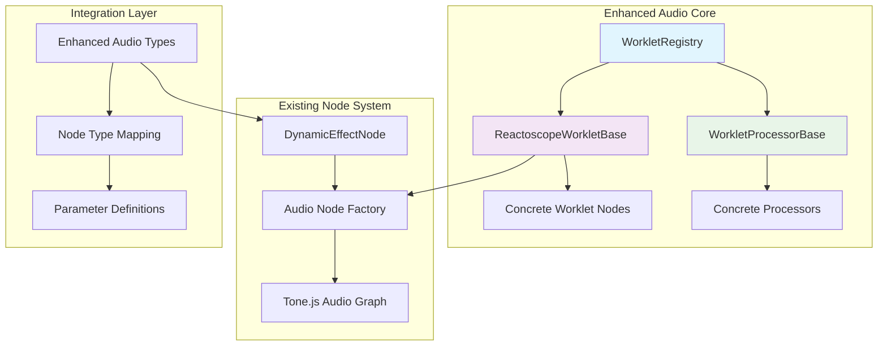

# AudioWorklet Integration Implementation Plan

This document outlines a comprehensive plan for implementing AudioWorklet support in the Reactoscope project, based on the successful patterns from the tone-audioworklet-demo analysis and your existing architecture.

---

## 🎯 Project Context & Goals

### Current State Analysis

Your `rs-stripped` project already has:

- **Existing Audio Architecture**: Basic `ToneAudioWorklet` class extending `Tone.ToneAudioNode`
- **Node-Based System**: React Flow nodes with audio node type mapping
- **Modular Structure**: Organized into `audio/`, `nodes/`, `shared/` directories
- **TypeScript Foundation**: Strong typing throughout with audio parameter interfaces

### Integration Goals

1. **Enhanced Worklet Support**: Upgrade from basic worklet wrapper to sophisticated registry system
2. **Seamless Node Integration**: Make worklet-based nodes work transparently within existing node system
3. **Parameter Automation**: Bridge Tone.js parameters with worklet AudioParams
4. **Performance Optimization**: Minimize worklet loading overhead and enable code sharing
5. **Developer Experience**: Provide easy-to-use patterns for creating new worklet-based effects

---

## 🏗️ Architecture Design

### Core Components Overview



### File Structure Plan

```
src/audio/
├── core/
│   ├── index.ts
│   ├── ReactoscopeWorkletBase.ts        # Enhanced base class
│   ├── WorkletRegistry.ts               # Code compilation system
│   └── worklet/                         # Worklet-thread code
│       ├── ReactoscopeWorkletProcessor.worklet.ts
│       ├── SingleIOProcessor.worklet.ts
│       └── MultiIOProcessor.worklet.ts
├── effects/
│   ├── worklet/                         # Worklet-based effects
│   │   ├── BitCrusherWorkletNode.ts
│   │   ├── SpectralFilterWorkletNode.ts
│   │   └── GranularDelayWorkletNode.ts
│   └── [existing effects...]
├── worklets/
│   ├── processors/                      # Worklet processor implementations
│   │   ├── BitCrusher.worklet.ts
│   │   ├── SpectralFilter.worklet.ts
│   │   └── GranularDelay.worklet.ts
│   └── source/                         # Source worklet processors
│       ├── NoiseGenerator.worklet.ts
│       └── AdvancedOscillator.worklet.ts
├── types/
│   ├── index.ts                        # Enhanced with worklet types
│   └── worklet.ts                      # Worklet-specific type definitions
└── hooks/
    ├── useWorkletNode.ts               # Generic worklet node hook
    └── useWorkletRegistry.ts           # Registry management hook
```

---

## 📋 Implementation Phases

### Phase 1: Core Worklet Infrastructure

#### 1.1 Enhanced WorkletRegistry System

Create `src/audio/core/WorkletRegistry.ts`:

```typescript
/**
 * Enhanced WorkletRegistry for Reactoscope
 *
 * Builds upon tone-audioworklet-demo patterns with Reactoscope-specific features:
 * - Integration with existing audio node types
 * - Support for multi-channel processors
 * - Debug logging aligned with project patterns
 * - TypeScript-first design
 */

interface ReactoscopeWorkletRegistry {
	baseClasses: Set<string>;
	processors: Set<string>;
	utilities: Set<string>;
	registrations: Map<string, WorkletRegistration>;
}

interface WorkletRegistration {
	name: string;
	classCode: string;
	nodeType: AudioNodeType; // Links to existing type system
	parameterDescriptors: AudioParamDescriptor[];
	channels: { inputs: number; outputs: number };
}

export class WorkletRegistry {
	private static instance: WorkletRegistry;
	private registry: ReactoscopeWorkletRegistry;
	private compiledCode: string | null = null;
	private isRegistered = false;

	// Singleton pattern for global registry
	static getInstance(): WorkletRegistry;

	// Core registry methods
	addBaseClass(classCode: string): void;
	addUtility(utilityCode: string): void;
	registerProcessor(registration: WorkletRegistration): void;

	// Compilation and loading
	getCompiledWorkletCode(debug?: boolean): string;
	async registerWithAudioContext(context: Tone.Context): Promise<void>;

	// Integration helpers
	isProcessorRegistered(name: string): boolean;
	getProcessorInfo(name: string): WorkletRegistration | undefined;
	getProcessorsByNodeType(nodeType: AudioNodeType): WorkletRegistration[];
}
```

#### 1.2 ReactoscopeWorkletBase Class

Create `src/audio/core/ReactoscopeWorkletBase.ts`:

```typescript
/**
 * Enhanced base class extending your existing ToneAudioWorklet
 *
 * Key improvements:
 * - Automatic worklet registration via registry
 * - Parameter mapping with type safety
 * - Integration with existing node parameter system
 * - Promise-based readiness handling
 * - Proper disposal and cleanup
 */

export interface ReactoscopeWorkletOptions extends ToneAudioWorkletOptions {
	nodeType: AudioNodeType; // Links to your existing type system
	parameters?: Record<string, number | string | boolean>;
	debug?: boolean;
}

export abstract class ReactoscopeWorkletBase<
	Options extends ReactoscopeWorkletOptions,
> extends ToneAudioWorklet<Options> {
	protected abstract getProcessorName(): string;
	protected abstract onWorkletReady(worklet: AudioWorkletNode): void;

	// Parameter management
	protected parameters: Map<string, Tone.Param> = new Map();

	// Registry integration
	private static async ensureWorkletRegistered(): Promise<void>;

	// Enhanced initialization
	constructor(options: Options);

	// Parameter helpers
	protected createParameter<T extends Tone.Unit.Name>(
		name: string,
		initialValue: number,
		units: T,
		min?: number,
		max?: number
	): Tone.Param<T>;

	protected mapParameterToWorklet(
		paramName: string,
		toneParam: Tone.Param,
		workletParam: AudioParam
	): void;

	// Lifecycle management
	get ready(): Promise<void>;
	dispose(): this;
}
```

#### 1.3 Worklet Processor Base Classes

Create `src/audio/core/worklet/ReactoscopeWorkletProcessor.worklet.ts`:

```typescript
/**
 * Base processor class for Reactoscope worklets
 *
 * Features:
 * - Message handling for parameter updates
 * - Debug logging support
 * - Lifecycle management
 * - Performance monitoring hooks
 */

class ReactoscopeWorkletProcessor extends AudioWorkletProcessor {
	protected disposed = false;
	protected debug = false;
	protected blockSize = 128;

	constructor(options: AudioWorkletNodeOptions) {
		super(options);
		// Set up message handling, debug mode, etc.
	}

	protected onMessage(event: MessageEvent): void;
	protected onParameterChange(name: string, value: number): void;
	protected log(message: string, ...args: any[]): void;
}
```

Create `src/audio/core/worklet/SingleIOProcessor.worklet.ts` and `MultiIOProcessor.worklet.ts` for different processing patterns.

### Phase 2: Integration with Existing Node System

#### 2.1 Enhanced Audio Types

Update `src/audio/types/index.ts`:

```typescript
// Add worklet-specific types
export type WorkletAudioNodeType =
	| 'bitcrusher'
	| 'spectralfilter'
	| 'granulardelay'
	| 'advancedoscillator'
	| 'noisegenerator';

// Extend existing AudioNodeType
export type AudioNodeType =
	| 'oscillator'
	| 'player'
	// ... existing types
	| WorkletAudioNodeType;

// Add worklet parameter interfaces
export interface BitCrusherParams {
	bits: number;
	sampleRate: number;
	wet: number;
}

export interface SpectralFilterParams {
	cutoff: number;
	resonance: number;
	filterType: 'lowpass' | 'highpass' | 'bandpass';
	fftSize: number;
}

// ... other worklet parameter interfaces
```

#### 2.2 Enhanced DynamicEffectNode

Update existing `DynamicEffectNode` to support worklet-based effects:

```typescript
// In src/nodes/effect/DynamicEffectNode.tsx

const WORKLET_EFFECTS = ['bitcrusher', 'spectralfilter', 'granulardelay'];

function DynamicEffectNode({ data }: { data: EffectNodeData }) {
  const effectType = data.effectType;
  const isWorkletEffect = WORKLET_EFFECTS.includes(effectType);

  if (isWorkletEffect) {
    return <WorkletEffectNodeComponent data={data} />;
  }

  // Existing logic for non-worklet effects
  return <StandardEffectNodeComponent data={data} />;
}
```

#### 2.3 Audio Node Factory Enhancement

Update your audio node factory to handle worklet creation:

```typescript
// In audio factory/creation logic

async function createAudioNode(
	type: AudioNodeType,
	params: AudioNodeParams
): Promise<Tone.ToneAudioNode> {
	if (isWorkletNodeType(type)) {
		// Ensure worklets are registered
		await WorkletRegistry.getInstance().registerWithAudioContext(
			Tone.getContext()
		);

		// Create worklet-based node
		switch (type) {
			case 'bitcrusher':
				return new BitCrusherWorkletNode(params as BitCrusherParams);
			case 'spectralfilter':
				return new SpectralFilterWorkletNode(params as SpectralFilterParams);
			// ... other worklet types
		}
	}

	// Existing logic for standard Tone.js nodes
	return createStandardAudioNode(type, params);
}
```

### Phase 3: Concrete Worklet Implementations

#### 3.1 Example: BitCrusher Implementation

Create `src/audio/effects/worklet/BitCrusherWorkletNode.ts`:

```typescript
export interface BitCrusherWorkletNodeOptions
	extends ReactoscopeWorkletOptions {
	bits?: number;
	sampleRate?: number;
	wet?: number;
}

export class BitCrusherWorkletNode extends ReactoscopeWorkletBase<BitCrusherWorkletNodeOptions> {
	readonly name = 'BitCrusherWorkletNode';

	// Tone.js style I/O
	readonly input: Tone.Gain;
	readonly output: Tone.Gain;

	// Parameters
	readonly bits: Tone.Param<'positive'>;
	readonly sampleRateReduction: Tone.Param<'positive'>;
	readonly wet: Tone.Param<'normalRange'>;

	constructor(options: Partial<BitCrusherWorkletNodeOptions> = {}) {
		const opts = { ...BitCrusherWorkletNode.getDefaults(), ...options };
		super(opts);

		// Create I/O nodes
		this.input = new Tone.Gain({ context: this.context });
		this.output = new Tone.Gain({ context: this.context });

		// Create parameters
		this.bits = this.createParameter('bits', opts.bits!, 'positive', 1, 16);
		this.sampleRateReduction = this.createParameter(
			'sampleRate',
			opts.sampleRate!,
			'positive',
			1,
			48000
		);
		this.wet = this.createParameter('wet', opts.wet!, 'normalRange', 0, 1);
	}

	protected getProcessorName(): string {
		return 'reactoscope-bitcrusher';
	}

	protected onWorkletReady(worklet: AudioWorkletNode): void {
		// Set up audio routing
		this.input.connect(worklet).connect(this.output);

		// Map parameters
		this.mapParameterToWorklet(
			'bits',
			this.bits,
			worklet.parameters.get('bits')!
		);
		this.mapParameterToWorklet(
			'sampleRate',
			this.sampleRateReduction,
			worklet.parameters.get('sampleRate')!
		);
		this.mapParameterToWorklet('wet', this.wet, worklet.parameters.get('wet')!);
	}

	static getDefaults(): BitCrusherWorkletNodeOptions {
		return {
			...ReactoscopeWorkletBase.getDefaults(),
			nodeType: 'bitcrusher',
			bits: 8,
			sampleRate: 8000,
			wet: 1.0,
		};
	}
}
```

Create corresponding processor `src/audio/worklets/processors/BitCrusher.worklet.ts`:

```typescript
// Import base classes
import './SingleIOProcessor.worklet';
import { registerProcessor } from '../../core/WorkletRegistry';

const bitCrusherProcessor = /* javascript */ `
class ReactoscopeBitCrusherProcessor extends SingleIOProcessor {
  static get parameterDescriptors() {
    return [
      { name: 'bits', defaultValue: 8, minValue: 1, maxValue: 16 },
      { name: 'sampleRate', defaultValue: 8000, minValue: 1, maxValue: 48000 },
      { name: 'wet', defaultValue: 1.0, minValue: 0, maxValue: 1 }
    ];
  }
  
  generate(input, channel, parameters) {
    // Bit reduction
    const step = Math.pow(0.5, parameters.bits - 1);
    const crushed = step * Math.floor(input / step + 0.5);
    
    // Sample rate reduction (simplified)
    // In real implementation, you'd need proper downsampling/upsampling
    
    // Wet/dry mix
    return input * (1 - parameters.wet) + crushed * parameters.wet;
  }
}
`;

registerProcessor({
	name: 'reactoscope-bitcrusher',
	classCode: bitCrusherProcessor,
	nodeType: 'bitcrusher',
	parameterDescriptors: [
		{ name: 'bits', defaultValue: 8, minValue: 1, maxValue: 16 },
		{ name: 'sampleRate', defaultValue: 8000, minValue: 1, maxValue: 48000 },
		{ name: 'wet', defaultValue: 1.0, minValue: 0, maxValue: 1 },
	],
	channels: { inputs: 1, outputs: 1 },
});
```

### Phase 4: React Integration

#### 4.1 Generic Worklet Hook

Create `src/audio/hooks/useWorkletNode.ts`:

```typescript
export function useWorkletNode<T extends ReactoscopeWorkletBase<any>>(
	NodeClass: new (options: any) => T,
	options: any = {}
) {
	const [node, setNode] = useState<T | null>(null);
	const [isReady, setIsReady] = useState(false);
	const nodeRef = useRef<T | null>(null);

	useEffect(() => {
		const createNode = async () => {
			try {
				const newNode = new NodeClass(options);
				await newNode.ready; // Wait for worklet to be ready

				nodeRef.current = newNode;
				setNode(newNode);
				setIsReady(true);
			} catch (error) {
				console.error('Failed to create worklet node:', error);
			}
		};

		createNode();

		return () => {
			if (nodeRef.current) {
				nodeRef.current.dispose();
			}
		};
	}, []); // Empty deps - create once

	return { node, isReady };
}
```

#### 4.2 Worklet Effect Node Component

Create `src/nodes/effect/WorkletEffectNodeComponent.tsx`:

```typescript
function WorkletEffectNodeComponent({ data }: { data: EffectNodeData }) {
  const { effectType, parameters } = data;

  // Use the generic hook with the appropriate worklet class
  const NodeClass = getWorkletNodeClass(effectType);
  const { node, isReady } = useWorkletNode(NodeClass, parameters);

  // Register node with audio system when ready
  useEffect(() => {
    if (isReady && node) {
      // Register with your existing audio node registry
      registerAudioNode(data.id, node, effectType);
    }
  }, [isReady, node, data.id, effectType]);

  return (
    <div className="worklet-effect-node">
      <NodeHeader title={`${effectType} (Worklet)`} />
      {!isReady && <LoadingIndicator />}
      {isReady && (
        <ParameterControls
          node={node}
          parameters={parameters}
          onParameterChange={(param, value) => {
            if (node && param in node) {
              // Use Tone.js parameter automation
              (node as any)[param].rampTo(value, 0.05);
            }
          }}
        />
      )}
      <AudioHandles />
    </div>
  );
}
```

---

## 🎛️ Advanced Features & Optimizations

### Multi-Channel Processing

For advanced effects requiring multiple inputs/outputs:

```typescript
export class SpectralFilterWorkletNode extends ReactoscopeWorkletBase<SpectralFilterOptions> {
	// Multiple analysis outputs
	readonly spectralData: Tone.Gain; // For analysis visualization
	readonly processedOutput: Tone.Gain; // For audio output

	protected onWorkletReady(worklet: AudioWorkletNode): void {
		// Set up complex routing for spectral analysis + processing
		this.input.connect(worklet, 0, 0); // Input to processor
		worklet.connect(this.processedOutput, 0, 0); // Processed audio out
		worklet.connect(this.spectralData, 0, 1); // Analysis data out
	}
}
```

### Parameter Automation Integration

Ensure smooth integration with your existing parameter automation:

```typescript
// In WorkletEffectNodeComponent
const handleParameterChange = useCallback(
	(paramName: string, value: number) => {
		if (node && paramName in node) {
			const param = (node as any)[paramName];
			if (param && typeof param.rampTo === 'function') {
				// Smooth automation using Tone.js
				param.rampTo(value, 0.05); // 50ms ramp
			} else {
				// Direct assignment for non-automatable params
				param.value = value;
			}
		}
	},
	[node]
);
```

### Performance Monitoring

Add performance monitoring to worklets:

```typescript
// In ReactoscopeWorkletProcessor.worklet.ts
class ReactoscopeWorkletProcessor extends AudioWorkletProcessor {
	private processTime = 0;
	private maxProcessTime = 0;

	process(inputs, outputs, parameters) {
		const startTime = performance.now();

		// ... processing logic

		if (this.debug) {
			this.processTime = performance.now() - startTime;
			this.maxProcessTime = Math.max(this.maxProcessTime, this.processTime);

			// Report performance every 1000 blocks
			if (this.blockCount % 1000 === 0) {
				this.port.postMessage({
					type: 'performance',
					avgTime: this.processTime,
					maxTime: this.maxProcessTime,
				});
			}
		}

		return !this.disposed;
	}
}
```

---

## 🧪 Testing Strategy

### Unit Tests for Core Components

```typescript
// tests/audio/WorkletRegistry.test.ts
describe('WorkletRegistry', () => {
	test('should compile worklet code in correct order', () => {
		const registry = WorkletRegistry.getInstance();
		// Add base classes, processors, etc.
		const compiled = registry.getCompiledWorkletCode();
		expect(compiled).toContain('class ReactoscopeWorkletProcessor');
		expect(compiled).toContain('registerProcessor');
	});
});

// tests/audio/ReactoscopeWorkletBase.test.ts
describe('ReactoscopeWorkletBase', () => {
	test('should initialize worklet and resolve ready promise', async () => {
		const node = new TestWorkletNode();
		await expect(node.ready).resolves.toBeUndefined();
		expect(node.isReady).toBe(true);
	});
});
```

### Integration Tests

```typescript
// tests/integration/worklet-nodes.test.ts
describe('Worklet Node Integration', () => {
	test('should integrate with existing audio graph', async () => {
		const oscillator = new Tone.Oscillator();
		const bitCrusher = new BitCrusherWorkletNode();
		await bitCrusher.ready;

		oscillator.connect(bitCrusher).toDestination();
		// Test audio routing and parameter changes
	});
});
```

---

## 📈 Migration Strategy

### Phase 1: Infrastructure (Week 1-2)

1. Implement `WorkletRegistry` and base classes
2. Create basic processor base classes
3. Add worklet types to existing type system

### Phase 2: First Worklet Effect (Week 3-4)

1. Implement `BitCrusherWorkletNode` as proof of concept
2. Integrate with existing `DynamicEffectNode`
3. Test in development environment

### Phase 3: Additional Effects (Week 5-6)

1. Add `SpectralFilterWorkletNode` for advanced processing
2. Implement `GranularDelayWorkletNode` for complex timing effects
3. Add worklet-based source nodes

### Phase 4: Optimization & Polish (Week 7-8)

1. Performance optimization and monitoring
2. Error handling and fallbacks
3. Documentation and examples

---

## 🎯 Success Metrics

- **Performance**: Worklet effects should process audio with <1ms latency
- **Integration**: Worklet nodes should work seamlessly with existing audio routing
- **Developer Experience**: Creating new worklet effects should require minimal boilerplate
- **Type Safety**: Full TypeScript support throughout worklet system
- **Reliability**: Graceful handling of worklet loading failures

---

## 📚 Next Steps

1. **Review and Approve**: Review this plan and adjust based on project priorities
2. **Setup Development Branch**: Create feature branch for worklet integration
3. **Implement Phase 1**: Start with core infrastructure components
4. **Incremental Testing**: Test each phase thoroughly before proceeding
5. **Documentation**: Update project documentation as features are implemented

This plan provides a solid foundation for integrating advanced AudioWorklet capabilities into your Reactoscope project while maintaining compatibility with your existing architecture and following established patterns from the tone-audioworklet-demo analysis.
