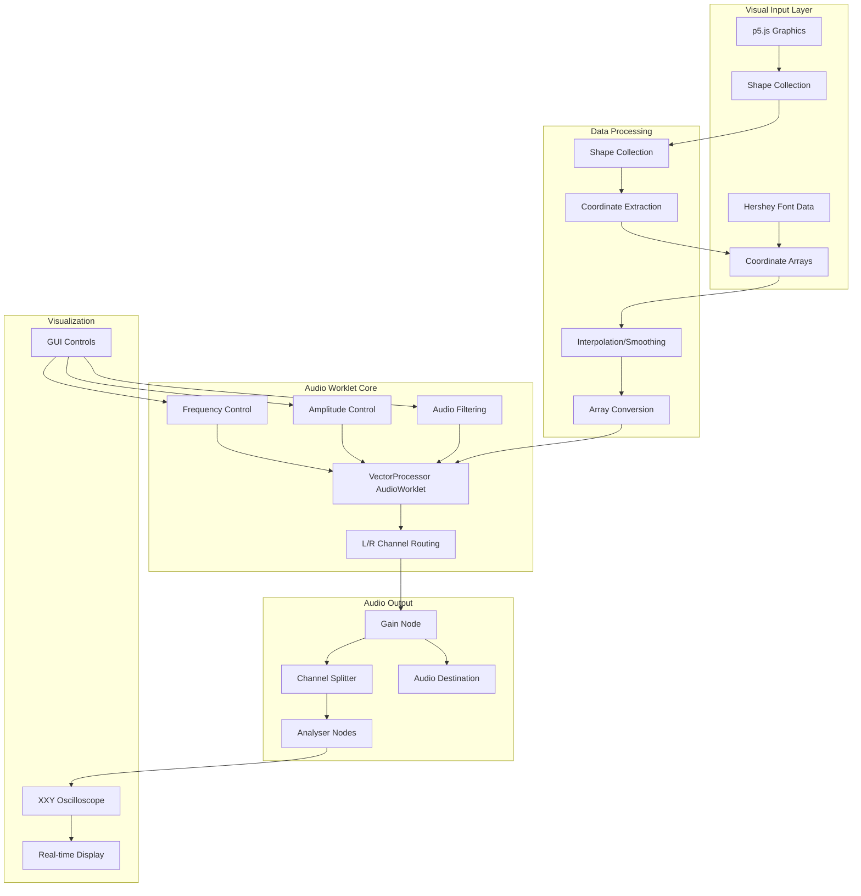
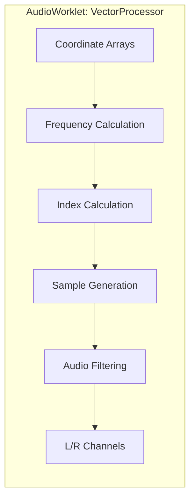
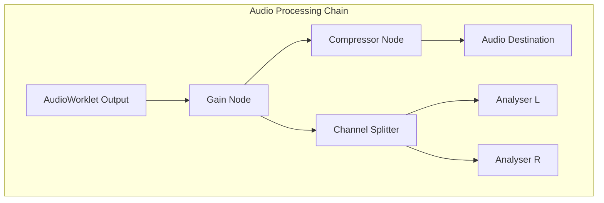
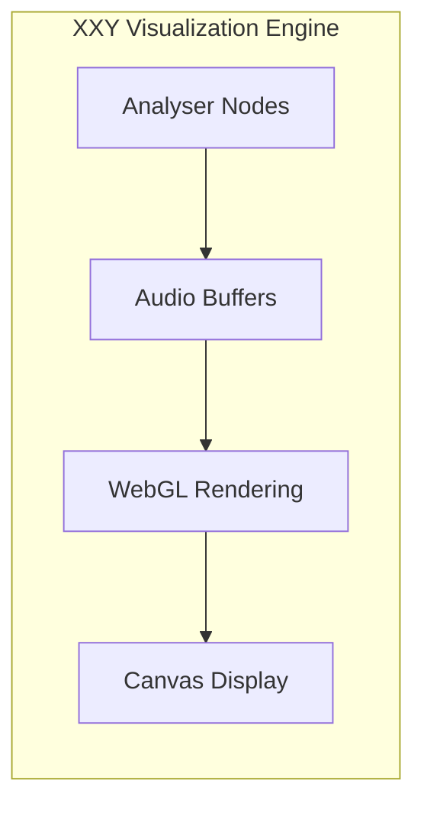

# XYscope.js Data Flow Analysis

## Overview

XYscope.js is a sophisticated audio-visual synthesis library that converts 2D coordinate data into real-time audio signals for oscilloscope visualization. It bridges the gap between visual graphics and audio synthesis using Web Audio API.

## Core Architecture



## Detailed Data Flow

### 1. Visual Data Generation

```
p5.js Graphics → Shape Objects → Coordinate Arrays
```

**Input Sources:**

- p5.js drawing commands (`line()`, `ellipse()`, `bezier()`, etc.)
- Hershey vector font rendering
- Custom shape definitions
- Real-time drawing operations

**Data Structure:**

```javascript
this.coords = {
    x: [x1, x2, x3, ...], // X coordinates
    y: [y1, y2, y3, ...]  // Y coordinates
}
```

### 2. Shape Collection & Processing

**Shape Collection:**

```javascript
this.shapes = [
    {
        coords: { x: [...], y: [...] },
        strokeWeight: 1,
        color: [r, g, b],
        closed: false
    }
    // ... more shapes
]
```

**Coordinate Processing:**

- **Constraint Mapping**: Values constrained to [-1, 1] range
- **Interpolation**: Optional smoothing between points
- **Gap Insertion**: Configurable gaps between shapes
- **Mirror/Transform**: Coordinate transformations

### 3. AudioWorklet Processing Engine



**Core Processing Algorithm:**

```javascript
// In AudioWorklet process() method
const indexIncrementLeft = effectiveFrequencyX / sampleRate;
const indexIncrementRight = effectiveFrequencyY / sampleRate;

for (let i = 0; i < frameCount; i++) {
	// Get array indices
	let indexLeft = Math.floor(leftIndex * xCoords.length) % xCoords.length;
	let indexRight = Math.floor(rightIndex * yCoords.length) % yCoords.length;

	// Sample coordinate arrays
	let rawLeftValue = xCoords[indexLeft] * amplitude.x;
	let rawRightValue = yCoords[indexRight] * amplitude.y * -1.0;

	// Apply filtering
	if (lowPassFreq) {
		/* low-pass filter */
	}
	if (highPassFreq) {
		/* high-pass filter */
	}

	// Output to channels
	leftChannel[i] = rawLeftValue;
	rightChannel[i] = rawRightValue;

	// Increment indices
	leftIndex += indexIncrementLeft;
	rightIndex += indexIncrementRight;
}
```

### 4. Audio Signal Path



**Signal Characteristics:**

- **Sample Rate**: Typically 44.1kHz or 48kHz
- **Channels**: 2 (Left = X, Right = Y)
- **Range**: [-1, 1] normalized audio range
- **Frequency**: Configurable scan rate (Hz)

### 5. Real-time Visualization (XXY Oscilloscope)



**Visualization Process:**

1. **Audio Analysis**: Analyser nodes capture L/R audio streams
2. **Buffer Processing**: Convert audio samples to coordinate pairs
3. **WebGL Rendering**: Hardware-accelerated vector drawing
4. **Real-time Display**: Oscilloscope-style visualization

## Key Parameters & Controls

### Frequency Control

```javascript
this.frequency = { x: 50, y: 50 }; // Hz
```

- Controls scan rate through coordinate arrays
- Independent X/Y frequency control
- Range: 0.1Hz - 1000Hz+

### Amplitude Control

```javascript
this.amplitude = { x: 1.0, y: 1.0 };
```

- Scales output signal strength
- Independent X/Y amplitude
- Range: 0.0 - 2.0+

### Audio Filtering

- **Low-pass Filter**: Smooths high-frequency content
- **High-pass Filter**: Removes DC offset and low frequencies
- **Real-time Parameter Control**: Dynamic filter adjustment

### Interpolation & Smoothing

```javascript
this.interpolation = true;
this.gapSize = 1; // Gap between shapes
```

## Performance Considerations

### AudioWorklet Advantages

- **Real-time Processing**: Sub-millisecond audio latency
- **Precise Timing**: Sample-accurate coordinate scanning
- **Thread Isolation**: Audio processing in dedicated thread
- **Memory Efficiency**: Direct Float32Array manipulation

### Optimization Techniques

- **Efficient Array Access**: Modulo operations for circular scanning
- **Filter State Management**: Persistent filter history
- **Channel Routing**: Flexible output channel assignment
- **Buffer Management**: Minimal memory allocation in audio thread

## Data Flow Summary

```
Visual Data → Coordinate Arrays → AudioWorklet → Audio Signals → Oscilloscope Display
    ↑                                ↑              ↑               ↑
p5.js Graphics              Frequency Control   Audio Processing   XXY Renderer
Hershey Fonts              Amplitude Control    Channel Routing    WebGL Display
Custom Shapes              Filter Parameters    Signal Analysis    Real-time GUI
```

## Integration Points

### Input Integration

- **p5.js**: Primary graphics framework
- **Canvas API**: Direct coordinate extraction
- **WebGL**: Hardware-accelerated rendering
- **Font Systems**: Hershey vector fonts

### Output Integration

- **Web Audio API**: Real-time audio synthesis
- **Oscilloscope Hardware**: Direct audio output
- **Recording Systems**: Audio stream capture
- **External DACs**: Multi-channel audio interfaces

## Use Cases

1. **Vector Graphics Sonification**: Convert drawings to audio
2. **Live Coding Performance**: Real-time audio-visual synthesis
3. **Oscilloscope Art**: Create vector art on oscilloscope displays
4. **Educational Tools**: Visualize audio/signal processing concepts
5. **Interactive Installations**: Touch/gesture-controlled audio-visual systems

---

_This analysis demonstrates how XYscope.js creates a seamless bridge between visual creativity and audio synthesis, enabling new forms of audio-visual expression through precise real-time coordinate-to-audio conversion._
